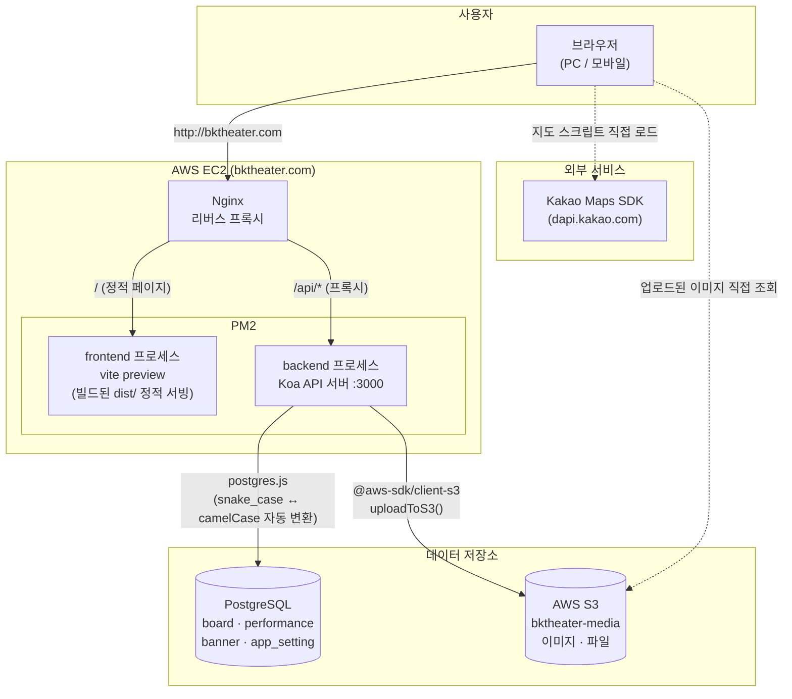
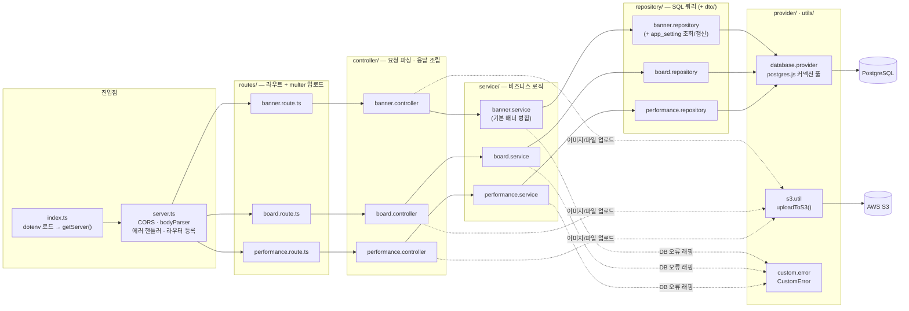
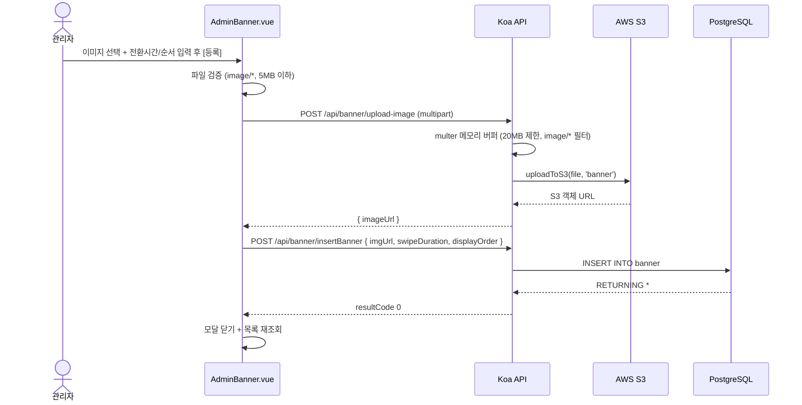
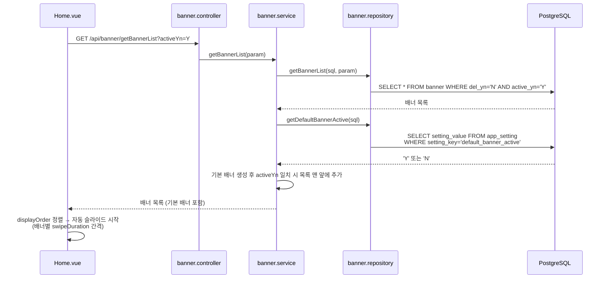
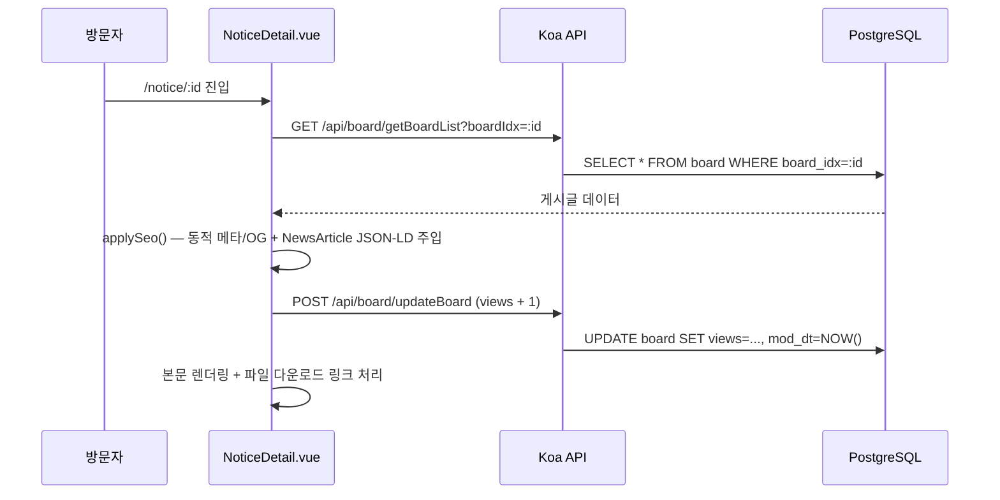
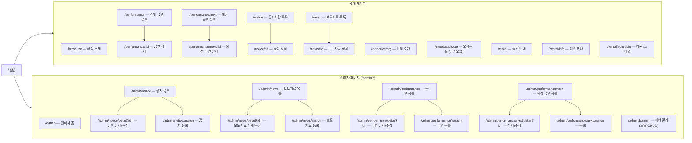
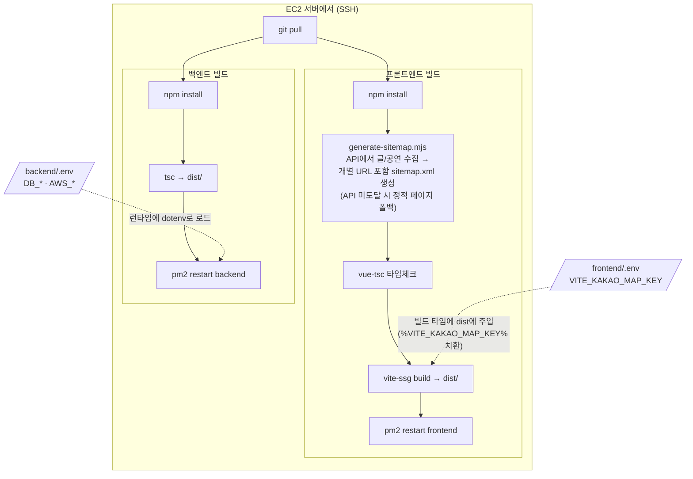
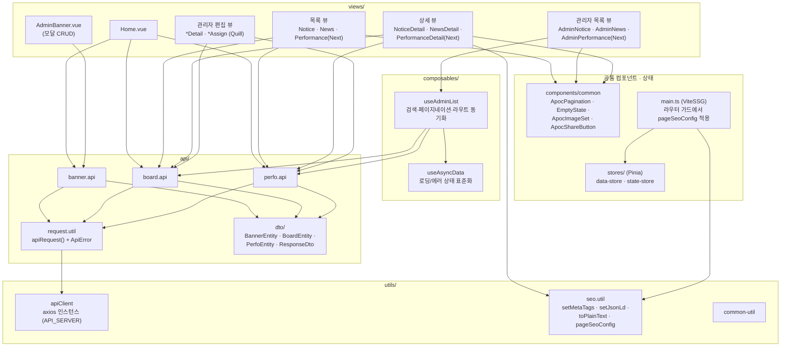

# 아키텍처 다이어그램

> 보광극장 홍보 및 대관 사이트의 구조를 Mermaid 다이어그램으로 정리한 문서입니다.
> GitHub에서 md 파일을 열면 다이어그램이 자동 렌더링됩니다.
> 데이터베이스 ERD는 별도 문서로 관리합니다. 스키마 정의는 [`../backend/ddl/ddl.sql`](../backend/ddl/ddl.sql) 참고.

---

## 1. 시스템 아키텍처 / 배포 구성

전체 요청 흐름과 인프라 구성입니다. 프론트엔드는 vite-ssg로 빌드된 정적 파일을 서빙하고, 백엔드는 Koa API 서버로 동작합니다.

- 프론트 환경변수(`VITE_KAKAO_MAP_KEY`)는 **빌드 시점**에 dist에 주입되고, 백엔드 환경변수(DB/AWS)는 **런타임**에 `backend/.env`에서 로드됩니다.
- 브라우저는 S3에 업로드된 이미지를 S3 URL로 직접 조회합니다 (백엔드를 경유하지 않음).

---

## 2. 백엔드 레이어드 아키텍처

`routes → controller → service → repository` 계층 구조입니다. 세 도메인(banner / board / performance)이 동일한 패턴을 따릅니다.

- 페이지네이션은 repository 계층에서 `getSafePagination`(rows 1~100 제한)으로 방어합니다.
- 기본 배너의 활성 상태는 `app_setting` 테이블(key: `default_banner_active`)에 영속화됩니다.

---

## 3. 주요 흐름 시퀀스 다이어그램

### 3-1. 배너 등록 (이미지 업로드 → 배너 저장, 2단계)

### 3-2. 홈 배너 조회 (기본 배너 병합)

### 3-3. 게시글 상세 조회 + 조회수 증가

---

## 4. 프론트엔드 라우트 맵

vite-ssg 기준 전체 라우트 구성입니다. 공개 상세 페이지는 SEO를 위해 경로 파라미터(`:id`)를 사용합니다.

- 공개 상세는 `/:id` 경로 파라미터, 관리자 상세는 기존 `?id=` 쿼리 방식을 유지합니다.
- `robots.txt`에서 `/admin`, `/api`는 크롤링 차단됩니다.

---

## 5. 빌드 & 배포 파이프라인

`.env`가 쓰이는 시점(프론트=빌드 타임, 백엔드=런타임)에 주의하세요.

- `npm run build` = `generate-sitemap` → (`type-check` ∥ `build-ssg`) 병렬 실행.
- **`pm2 restart frontend`는 빌드하지 않습니다.** 기존 `dist`만 다시 서빙하므로 변경 반영에는 반드시 `npm run build`가 선행되어야 합니다.
- `.env` 파일 두 개는 gitignore 대상이라 서버에 최초 1회 수동 생성합니다.

---

## 6. 프론트엔드 모듈 의존 다이어그램

뷰 → 컴포저블 → API 래퍼 → HTTP 클라이언트로 이어지는 의존 관계입니다.

- 관리자 목록 뷰 4개는 `useAdminList` 하나로 검색·페이지네이션 로직을 공유합니다 (뷰별 차이는 `buildParam`/`fetch` 주입).
- 모든 API 함수는 `apiRequest` 헬퍼를 거치며, 실패는 타입화된 `ApiError`로 던져집니다.
- 정적 페이지 SEO는 `main.ts` 라우터 가드(`pageSeoConfig`), 상세 페이지 SEO는 각 뷰의 `applySeo()`에서 처리합니다.
