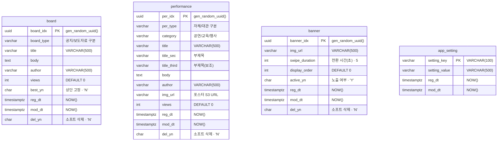

# 데이터베이스 스키마 (ERD)

보광극장 커뮤니티 사이트의 PostgreSQL 스키마입니다.
소스 DDL: [`community/backend/ddl/ddl.sql`](../backend/ddl/ddl.sql)

- 🔗 **편집용 (ERDCloud)**: https://www.erdcloud.com/d/ePApLSgiY2jWs6nZD
- 아래 다이어그램은 GitHub·IDE에서 바로 렌더링됩니다.

## 다이어그램

## 구조 요약

| 테이블 | 역할 | PK | 비고 |
|--------|------|----|------|
| `board` | 공지사항 / 보도자료 (`board_type`으로 구분) | `board_idx` (UUID) | `best_yn` 상단 고정, `del_yn` 소프트 삭제 |
| `performance` | 공연 — 자체 / 대관 (`per_type`), 카테고리 `category` | `per_idx` (UUID) | `img_url` 포스터(S3), `del_yn` 소프트 삭제 |
| `banner` | 홈 상단 배너 | `banner_idx` (UUID) | `active_yn` 노출, `display_order` 정렬 |
| `app_setting` | 전역 설정 (key-value) | `setting_key` | 서버 재시작·다중 인스턴스에서도 유지 |

## 관계

**테이블 간 명시적 외래키(FK)가 없습니다.** 네 테이블은 각각 독립적으로 운영되며,
모든 삭제는 `del_yn = 'N'` 기반 소프트 삭제입니다.

유일한 연결은 애플리케이션 레벨의 **논리적 연결** 하나입니다:

- `app_setting`의 `default_banner_active`(`'Y'/'N'`) 행이 홈 **기본 배너** 노출을 제어
- 단, `banner.banner_idx`를 참조하는 실제 FK가 아니라 설정값 기반 제어이므로 DB 관계는 아님

> 회원제·예약 등 기능이 추가되면 `user` 테이블과 FK가 필요해집니다. 현재는 단순 콘텐츠 사이트에 맞는 독립 테이블 구조입니다.
